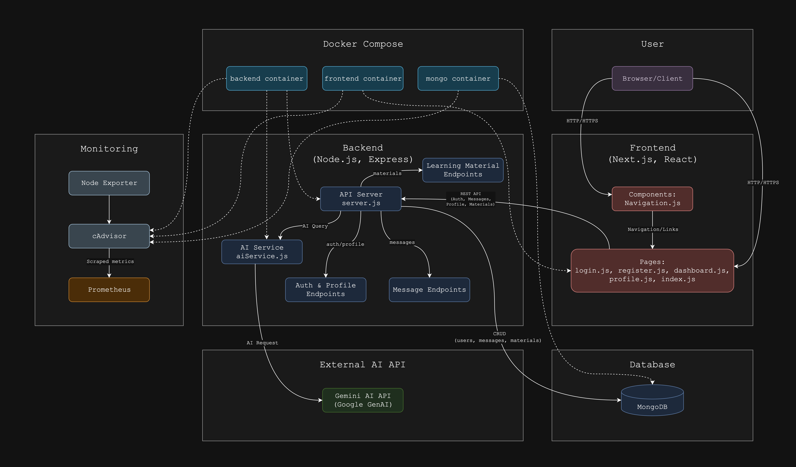

# BrainBytes AI Tutoring Platform

## Overview

BrainBytes is an AI-powered tutoring platform designed to provide accessible academic assistance to Filipino students. This project implements the platform using modern DevOps practices and containerization.

## Technology Stack

- **Frontend**: Next.js
- **Backend**: Node.js
- **Database**: MongoDB (Docker Container)
- **AI Model Integration**: Google Gemini API
- **Containerization**: Docker, Docker Compose
- **CI/CD**: GitHub Actions

## Docker Version Information

- **Docker version**: `$(docker --version)`
- **Docker Compose version**: `$(docker-compose --version)`

## Architecture Diagram



This diagram shows:

- Major frontend pages and components
- REST API flow between frontend and backend
- Backend endpoints for auth, profile, messages, and learning materials
- Persistent data storage in MongoDB
- AI model integration via Gemini API
- Docker containers for frontend, backend, and database
- Data flow and service interactions across the stack

---

## Monitoring & Observability

BrainBytes includes a robust monitoring stack using **Prometheus** and **Grafana** to provide real-time visibility into system health, performance, and usage.

### Monitoring Features

- **Prometheus** scrapes metrics from the backend (API, database, AI service) and system containers.
- **Grafana** provides dashboards for live visualization of key metrics (API latency, error rates, user activity, resource usage).
- **Alerting** is configured for critical conditions (e.g., backend/API downtime, high error rates, resource exhaustion).
- **Custom Metrics**: The backend exposes application-level metrics (request count, response time, error count, etc.) at `/metrics`.
- **Prebuilt Dashboards**: Ready-to-use Grafana dashboards for API, database, and system monitoring.

### Quick Start: Monitoring Stack

1. **Start Monitoring Services**
   - Prometheus and Grafana are included in `docker-compose.yml`.
   - They start automatically with `docker-compose up`.
2. **Access Grafana Dashboards**
   - Open [http://localhost:3001](http://localhost:3002) in your browser.
   - Default login: `admin` / `admin` (change after first login).
   - Explore dashboards for API, database, and system metrics.
3. **Prometheus UI**
   - Open [http://localhost:9090](http://localhost:9090) to view Prometheus targets and query metrics.
4. **Custom Metrics Endpoint**
   - The backend exposes metrics at [http://localhost:3000/metrics](http://localhost:3000/metrics).
5. **Alerts**
   - Alert rules are defined in `monitoring-docs/alert_rules.yml` and loaded by Prometheus.

### Monitoring Documentation

All monitoring documentation (setup guide, operations manual, performance guidelines, alerting, and dashboards) is available in the project Google Drive folder:

**[BrainBytes Monitoring Docs (Google Drive)](https://drive.google.com/drive/folders/1MFcp8QTUSEwF9qTrCrx9ppjB0QusO0XF?usp=drive_link)**

---

## Instructions for Running the Application

<h3>Method 1: ZIP Download &amp; Docker Compose</h3>
  
  <ol>
    <li>
      <strong>Download the code</strong><br>
      Navigate to the GitHub repository and click <em>Code → Download ZIP</em>.  
      Save the ZIP file to your computer.
    </li>
    <li>
      <strong>Unzip the folder</strong><br>
      <ul>
        <li><strong>Windows:</strong> Right‑click the ZIP &rarr; <em>Extract All…</em></li>
        <li><strong>macOS:</strong> Double‑click the ZIP</li>
      </ul>
      A folder named <code>brainbytes-multi-container</code> should appear.
    </li>
    <li>
      <strong>Open your terminal</strong><br>
      <ul>
        <li><strong>Windows:</strong> Press <kbd>Win</kbd> + <kbd>R</kbd>, type <code>cmd</code> or <code>powershell</code>, press <kbd>Enter</kbd></li>
        <li><strong>macOS:</strong> Press <kbd>⌘</kbd> + <kbd>Space</kbd>, type <code>Terminal</code>, press <kbd>Enter</kbd></li>
      </ul>
    </li>
    <li>
      <strong>Change into the project folder</strong><br>
      In the terminal, run:<br>
      <pre><code>cd path/to/brainbytes-multi-container</code></pre>
      Replace <code>path/to</code> with where you extracted the ZIP.
    </li>
    <li>
    <h4>Configure Environment Variables</h4>
      <p>
        The app needs a few secret keys to run. Create your own <code>.env</code> file:
      </p>
      <pre><code>cp .env.example .env</code></pre>
      <p>Then open <code>.env</code> in any text editor and fill in:</p>
      <ul>
        <li><code>GEMINI_API_KEY</code> — Your Google Gemini API key</li>
        <li><code>JWT_SECRET</code> — A random string used to sign authentication tokens</li>
      </ul>
      <p>If you have never used an <code>.env</code> file before, it simply lists lines like <code>KEY=value</code> that your app reads at startup.</p>
    </li>
    <li>
      <strong>Start Docker Desktop</strong><br>
      Launch <em>Docker Desktop</em> and wait until the whale icon appears in your system tray (Windows) or menu bar (macOS).
    </li>
    <li>
      <strong>Build the Docker images</strong><br>
      In your terminal (inside the project folder), run:<br>
      <pre><code>docker-compose build</code></pre>
      This can take a few minutes. You’ll see a series of “Step 1/…”, “Step 2/…” messages.
    </li>
    <li>
      <strong>Run the application</strong><br>
      Still in the same terminal, run:<br>
      <pre><code>docker-compose up</code></pre>
      Keep this window open to watch for any errors.
    </li>
    <li>
      <strong>Open the app in your browser</strong><br>
      Go to:<br>
      <pre><code>http://localhost:8080/</code></pre>
      You should see the BrainBytes interface. If you get an error, confirm Docker Desktop is running and check for build errors above.
    </li>
  </ol>
  
  <h3>Troubleshooting</h3>
  <ul>
    <li>
      <strong><code>docker-compose not found</code>:</strong>  
      Ensure Docker Desktop is installed and that you reopened your terminal after installation.
    </li>
    <li>
      <strong>Port 8080 already in use</strong>:<br>
      Stop the other service or edit <code>docker-compose.yml</code> (e.g. change <code>8080:80</code> to <code>8081:80</code>).
    </li>
    <li>
      <strong>Unexpected build/runtime errors</strong>:<br>
      View detailed logs with:<br>
      <pre><code>docker-compose logs</code></pre>
    </li>
  </ul>

<hr>
<h3>Method 2: Local Development with Git & Docker</h3>
  <p>
    Follow these steps to clone the source code, install dependencies, configure secrets, and run all services via Docker Compose. This method is best if you plan to customize or contribute to BrainBytes.
  </p>

  <h4>1. Open Your Terminal</h4>
  <p>
    Depending on your operating system, open one of these:
  </p>
  <ul>
    <li><strong>Windows:</strong> Start &rarr; type <code>cmd</code> or <code>powershell</code> and press Enter.</li>
    <li><strong>macOS:</strong> Press <code>⌘ Space</code>, type <code>Terminal</code>, and press Enter.</li>
    <li><strong>Alternatively:</strong> In VS Code, press <kbd>Ctrl</kbd> + <kbd>`</kbd> (backtick) to open the built‑in terminal.</li>
  </ul>

  <h4>2. Clone the Repository</h4>
  <p>
    “Cloning” means copying the code from GitHub to your computer. In your terminal, paste:
  </p>
  <pre><code>git clone https://github.com/Sempuri/brainbytesAI.git
cd brainbytesAI
git checkout development
</code></pre>
  <p>
    - <code>git clone &lt;url&gt;</code> downloads the project.<br>
    - <code>cd brainbytesAI</code> moves into the new folder.<br>
    - <code>git checkout development</code> switches to the development branch.
  </p>

  <h4>3. Configure Environment Variables</h4>
  <p>
    The app needs a few secret keys to run. Create your own <code>.env</code> file:
  </p>
  <pre><code>cp .env.example .env</code></pre>
  <p>Then open <code>.env</code> in any text editor and fill in:</p>
  <ul>
    <li><code>GEMINI_API_KEY</code> — Your Google Gemini API key</li>
    <li><code>JWT_SECRET</code> — A random string used to sign authentication tokens</li>
  </ul>
  <p>If you have never used an <code>.env</code> file before, it simply lists lines like <code>KEY=value</code> that your app reads at startup.</p>

  <h4>4. Start Docker and Run Containers</h4>
  <p>
    Make sure <strong>Docker Desktop</strong> is installed and running (you should see the Docker whale icon in your system tray or menu bar).
  </p>
  <pre><code>docker-compose up -d</code></pre>
  <p>
    - <code>up</code> tells Docker Compose to start all services.<br>
    - <code>-d</code> runs them in the background (“detached mode”), so you still control your terminal.
  </p>

  <h4>5. Verify Everything Is Running</h4>
  <p>
    To check that each service (frontend, backend, database) is healthy, run:
  </p>
  <pre><code>docker-compose ps</code></pre>
  <p>
    Look for “Up” in the “State” column. If any container shows an error or exited, you may need to scroll its logs:
  </p>
  <pre><code>docker-compose logs &lt;service-name&gt;</code></pre>

  <h4>6. Access the Application</h4>
  <p>
    Once all containers are up, open your browser and navigate to:
  </p>
  <ul>
    <li><strong>Frontend:</strong> <a href="http://localhost:8080">http://localhost:8080</a></li>
    <li><strong>Backend API:</strong> <a href="http://localhost:3000">http://localhost:3000</a></li>
    <li><strong>MongoDB (dev):</strong> <code>mongodb://localhost:27017/brainbytes</code></li>
  </ul>

  <h4>Troubleshooting Tips</h4>
  <ul>
    <li><strong>“command not found” for git/node/docker:</strong> Install the missing tool and reopen your terminal.</li>
    <li><strong>Port conflicts:</strong> If <code>8080</code> or <code>3000</code> is in use, stop the other service or change the port in <code>docker-compose.yml</code>.</li>
    <li><strong>Env vars not applied:</strong> Ensure <code>.env</code> is in the project root and that lines follow <code>KEY=value</code> syntax (no spaces).</li>
  </ul>

---

## API Documentation for the Endpoints Created

### Messages API

- **Endpoint**: /api/messages

  - **Method**: GET
  - **Description**: Get all chat messages
  - **Request Body**: None
  - **Response**: Array of message objects

- **Endpoint**: /api/messages
  - **Method**: POST
  - **Description**: Create user message and get AI response
  - **Request Body**: `{ "text": "user question" }`
  - **Response**: AI response with metadata

#### Example Response:

```json
{
  "userMessage": {
    "_id": "123",
    "text": "What is science?",
    "isUser ": true,
    "createdAt": "2023-01-01T00:00:00Z"
  },
  "aiMessage": {
    "_id": "456",
    "text": "Science is...",
    "isUser ": false,
    "createdAt": "2023-01-01T00:00:05Z"
  },
  "category": "science",
  "questionType": "definition",
  "sentiment": "neutral"
}
```

---

<h2>User Authentication &amp; Profile API</h2>

<h3>Register a New User</h3>
<ul>
  <li><strong>Endpoint:</strong> <code>POST /api/auth/register</code></li>
  <li><strong>Description:</strong> Register a new user account.</li>
  <li><strong>Request Body:</strong>
    <pre>{
  "name": "Your Name",
  "email": "you@example.com",
  "password": "yourpassword",
  "preferredSubjects": ["math", "science"]
}</pre>
  </li>
  <li><strong>Response:</strong>
    <pre>{
  "message": "User registered successfully",
  "token": "&lt;jwt_token&gt;",
  "user": {
    "id": "&lt;user_id&gt;",
    "name": "Your Name",
    "email": "you@example.com",
    "preferredSubjects": ["math", "science"]
  }
}</pre>
  </li>
</ul>

<h3>Login</h3>
<ul>
  <li><strong>Endpoint:</strong> <code>POST /api/auth/login</code></li>
  <li><strong>Description:</strong> Authenticate a user and receive a JWT token.</li>
  <li><strong>Request Body:</strong>
    <pre>{
  "email": "you@example.com",
  "password": "yourpassword"
}</pre>
  </li>
  <li><strong>Response:</strong>
    <pre>{
  "message": "Login successful",
  "token": "&lt;jwt_token&gt;",
  "user": {
    "id": "&lt;user_id&gt;",
    "name": "Your Name",
    "email": "you@example.com",
    "preferredSubjects": ["math", "science"]
  }
}</pre>
  </li>
</ul>

<h3>Get Current User Profile</h3>
<ul>
  <li><strong>Endpoint:</strong> <code>GET /api/auth/profile</code></li>
  <li><strong>Auth Required:</strong> Yes (Bearer token)</li>
  <li><strong>Description:</strong> Get the profile of the currently authenticated user.</li>
  <li><strong>Headers:</strong>
    <pre>Authorization: Bearer &lt;jwt_token&gt;</pre>
  </li>
  <li><strong>Response:</strong>
    <pre>{
  "name": "Your Name",
  "email": "you@example.com",
  "preferredSubjects": ["math", "science"],
  "createdAt": "...",
  "updatedAt": "...",
  "_id": "&lt;user_id&gt;"
}</pre>
  </li>
</ul>

<h3>Update Current User Profile</h3>
<ul>
  <li><strong>Endpoint:</strong> <code>PUT /api/auth/profile</code></li>
  <li><strong>Auth Required:</strong> Yes (Bearer token)</li>
  <li><strong>Description:</strong> Update the profile of the currently authenticated user.</li>
  <li><strong>Headers:</strong>
    <pre>Authorization: Bearer &lt;jwt_token&gt;</pre>
  </li>
  <li><strong>Request Body:</strong>
    <pre>{
  "name": "New Name",
  "preferredSubjects": ["math", "history"]
}</pre>
  </li>
  <li><strong>Response:</strong>
    <pre>{
  "_id": "&lt;user_id&gt;",
  "name": "New Name",
  "email": "you@example.com",
  "preferredSubjects": ["math", "history"],
  "createdAt": "...",
  "updatedAt": "..."
}</pre>
  </li>
</ul>

<p><strong>Note:</strong> All <code>/api/auth/profile</code> endpoints require a valid JWT token in the <code>Authorization</code> header.</p>

---

### Learning Materials API

- **Endpoint**: /api/materials

  - **Method**: GET
  - **Description**: Get all learning materials
  - **Request Body**: None
  - **Response**: Array of material objects

- **Endpoint**: /api/materials

  - **Method**: POST
  - **Description**: Create a new material
  - **Request Body**: Material data
  - **Response**: Created material object

- **Endpoint**: /api/materials/:id

  - **Method**: GET
  - **Description**: Get a specific material
  - **Request Body**: None
  - **Response**: Material object

- **Endpoint**: /api/materials/:id

  - **Method**: PUT
  - **Description**: Update a learning material
  - **Request Body**: Updated material data
  - **Response**: Updated material object

- **Endpoint**: /api/materials/:id
  - **Method**: DELETE
  - **Description**: Delete a learning material
  - **Request Body**: None
  - **Response**: Success message

#### Materials Data Format:

```json
{
  "subject": "math",
  "topic": "Algebra Basics",
  "content": "Algebra is a branch of mathematics..."
}
```

---

## Database Schema Design

We utilized MongoDB with the following collections:

### Messages Collection

```json
{
  "text": String,
  "isUser": Boolean,
  "category": String,
  "questionType": String,
  "sentiment": String,
  "createdAt": Date,
  "userId": ObjectId
}
```

**Purpose**: Stores the conversation history between users and the AI tutor.

### User Profiles Collection

```json
{
  "name": String,
  "email": String,
  "password": String,
  "preferredSubjects": [String],
  "createdAt": Date,
  "updatedAt": Date,
}
```

**Purpose**: Stores user information and learning preferences.

### Learning Materials Collection

```json
{
  "subject": String,
  "topic": String,
  "content": String,
  "createdAt": Date,
  "updatedAt": Date
}
```

**Purpose**: Stores educational content organized by subject and topic.

---

## AI Enhancements Implemented

### Subject Categorization

- Automatically classifies questions into subjects: math, science, history, literature, geography, and language.
- Uses keyword matching and pattern recognition.
- Improves response accuracy by providing subject-specific context.

### Sentiment Analysis

- Provides empathetic responses when negative sentiment is detected.
- Adapts tone to improve user experience.

### Fallback Mechanism

- Provides detailed responses when the API fails.
- Includes subject-specific answers for common questions.
- Handles basic math calculations locally when possible.

### Enhanced API Integration

- Uses Google Gemini's models with optimized prompts.
- Implements timeout handling and error recovery.
- Provides graceful degradation when API is unavailable.

---

## Team Members

- **Rei Emmanuel C** - Team Lead - [lr.recristobal@mmdc.mcl.edu.ph]
- **Kristine E** - Backend Developer - [lr.kencabo@mmdc.mcl.edu.ph]
- **Jodienne E** - Frontend Developer - [lr.jesperas@mmdc.mcl.edu.ph]
- **Vonne Carlo P** - DevOps Engineer - [lr.vcpediengco@mmdc.mcl.edu.ph]
