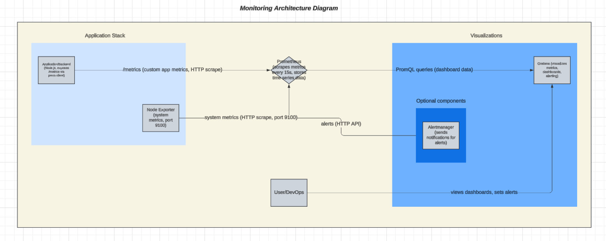

# Monitoring Architecture

## Overview Diagram

## Data Flow

1. **Application/Backend** exposes metrics at `/metrics` endpoint using prom-client.
2. **Node Exporter** exposes system metrics at port 9100.
3. **Prometheus** scrapes metrics from both the backend and node_exporter at regular intervals (default: 15s).
4. **Grafana** queries Prometheus to visualize metrics and display dashboards.
5. **Alerts** are triggered by Prometheus or Grafana based on metric thresholds.

## Retention Policy

- Prometheus retains metrics data for 15 days by default (configurable in Prometheus settings).

## Performance Considerations

- Scrape interval: 15 seconds (default).
- Resource usage: Prometheus and Grafana require moderate CPU and memory; node_exporter is lightweight.
- For large deployments, consider remote storage or federated Prometheus.

## Security Measures

- Prometheus and Grafana are accessible only on localhost by default.
- Authentication enabled for Grafana (default admin/admin, should be changed in production).
- Use firewalls or VPN to restrict access in production environments.
- Regularly update all monitoring components to patch vulnerabilities.
